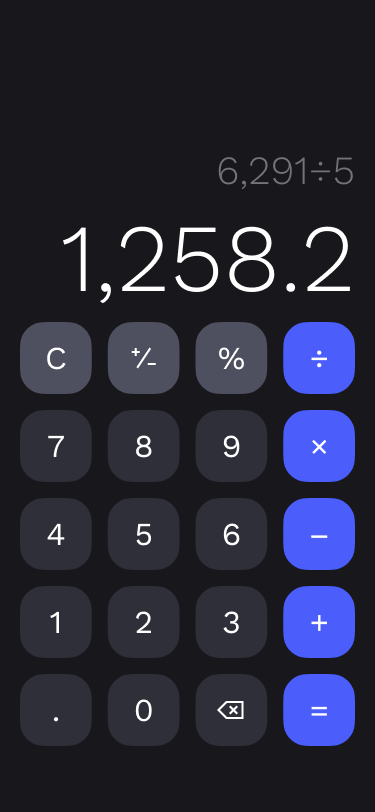
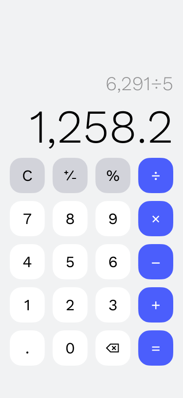

# • Calculator📱
This is a calculaotr app built with html css javascript.

## • Project Summary
**Welcome to my project!**   
This is a simple web application created using HTML, CSS, and JavaScript. 
It serves as a note-taking app where users can easily jot down and organize their thoughts. The minimalist design and intuitive user interface make it easy to use for anyone looking to streamline their note-taking process.  
Feel free to customize it to better fit your project and its features. Good luck! 🚀

## • Project Demo

  

## • Live Demo🤘
Here is a working live demo :  https://maniraad.github.io/calculator/
